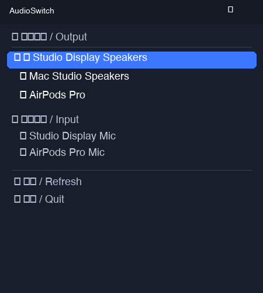
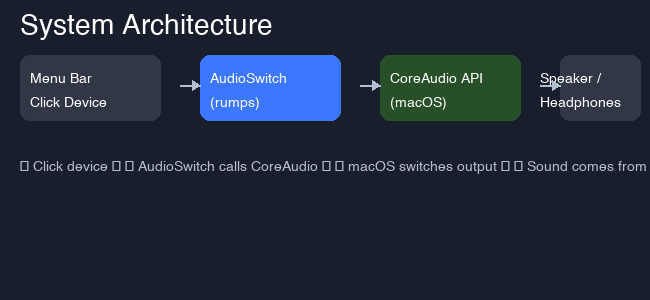

<h1 align="center">AudioClick 🔊</h1>

<p align="center">
  <b>One-click macOS audio device switcher — from your menu bar.</b><br>
  <b>菜单栏一键切换 macOS 音频输出设备。</b>
</p>

<p align="center">
  <a href="#-快速开始--quick-start"></a>
  <a href="https://github.com/Monah-Limited/AudioClick/stargazers"></a>
  <a href="LICENSE"></a>
  <br>
  
  
</p>

<p align="center">
  
  
</p>

---

## ✨ 功能 / Features

| | 中文 | English |
|---|---|---|
| 🔊 | 菜单栏显示当前音频输出设备 | Show current audio output in menu bar |
| 🔄 | 点击即可切换设备 | One-click device switching |
| 🎤 | 显示所有输出/输入设备 | List all output & input devices |
| 🔷 | 蓝牙/AirPlay/HDMI/USB 设备识别 | Bluetooth, USB, HDMI, AirPlay detection |
| ⚡ | 实时刷新（每 5 秒） | Auto-refresh every 5 seconds |

---

## 🚀 快速开始 / Quick Start

### 安装 / Install

```bash
# 克隆仓库
git clone https://github.com/Monah-Limited/AudioClick.git
cd AudioClick

# 安装依赖
pip install -r requirements.txt

# 运行
python src/audioclick.py
```

### 使用 / Usage

1. 运行后在菜单栏看到 🔊 图标
2. 点击展开设备列表
3. ★ 标记当前设备
4. 点击任意设备 → 立即切换

---

## 📸 截图 / Screenshots

<p align="center">
  
  
</p>

<p align="center">
  
</p>

---

## 🔧 工作原理 / How It Works

AudioClick 使用 macOS 的 **CoreAudio** 原生 API（而非 AppleScript），通过 `AudioHardwareGetProperty` / `AudioHardwareSetProperty` 直接枚举和切换音频设备。

```
AudioClick (rumps) → CoreAudio API → macOS Audio System → New Device Active
```

优点：
- ⚡ **毫秒级切换** — 比打开系统偏好设置快 100 倍
- 🔒 **原生 API** — 不依赖第三方工具
- 📋 **完整设备信息** — 名称、传输类型（USB/BT/HDMI）

---

## 🛠️ 技术栈 / Tech Stack

| 库 | 用途 |
|----|------|
| [rumps](https://github.com/jaredks/rumps) | macOS 菜单栏框架 |
| [pyobjc-framework-CoreAudio](https://pypi.org/project/pyobjc-framework-CoreAudio/) | CoreAudio 原生 API |
| [Pillow](https://python-pillow.org/) | 图标生成 |

---

## 🧠 "30 Apps in 100 Days"

Day 3 of **30 Apps in 100 Days**.

- Day 1: [SmartClipAI](https://github.com/Monah-Limited/SmartClipAI) — AI 剪贴板助手
- Day 2: [WeChatHermes](https://github.com/Monah-Limited/WeChatHermes) — 微信 AI 助手

---

## 📄 许可证 / License

MIT

**#macOS #audio #menu-bar #coreaudio #python #opensource #utility**
